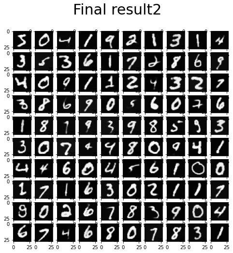
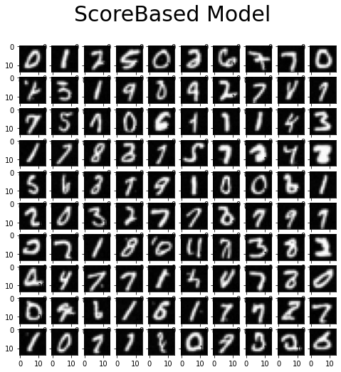

# Summary

- We conducted a series of experiments on the MNIST dataset, including  ddpm and conditional ddpm, as well as cold diffusion and score based model.
- You can run the main.py with command("ddpm/ddpm_conditional/cold_median/cold_kernel/cold_resolution/score/sde") to see our results of experiments.

## DDPM and DDPM Condtional

We use U-NET to generate a new image based on the image after adding noise

## Cold Diffusion

We tried three deterministic operations, adding median blur, mean blur and masking part of the image.

## Score Based Model

Following the idea of [], we construct a Noise Conditional Score Networks and apply it to Mnist dataset, with the Annealed Langevin Dynamic sampling method, we can generate new images as shown in `/results`. 

## Score SDE model
Following the idea of [], we tried to apply a U-net based Time-dependent Score Network on Mnist dataset. And with the an ode-solver sampler, we can generate new imagess as shown in `/results`. 

## References

* Denoising Diffusion Probabilistic Models, https://arxiv.org/abs/2006.11239
* Cold Diffusion: Inverting Arbitrary Image Transforms Without Noise,https://arxiv.org/abs/2208.09392
* Generative Modeling by Estimating Gradients of the Data Distribution,https://yang-song.net/blog/2021/score/
* Code of Noise Conditional Score Networks, https://github.com/ermongroup/ncsn/

